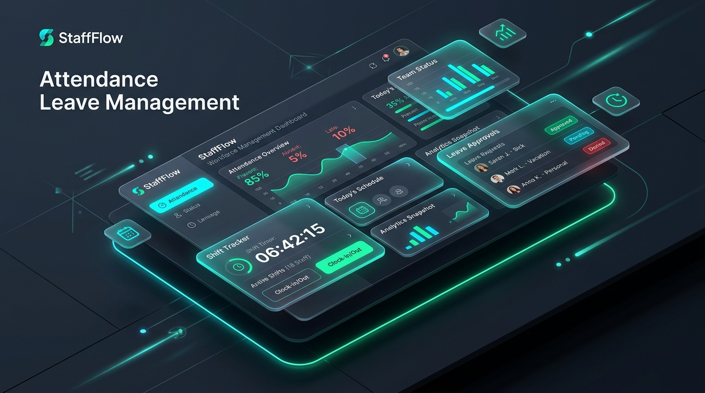
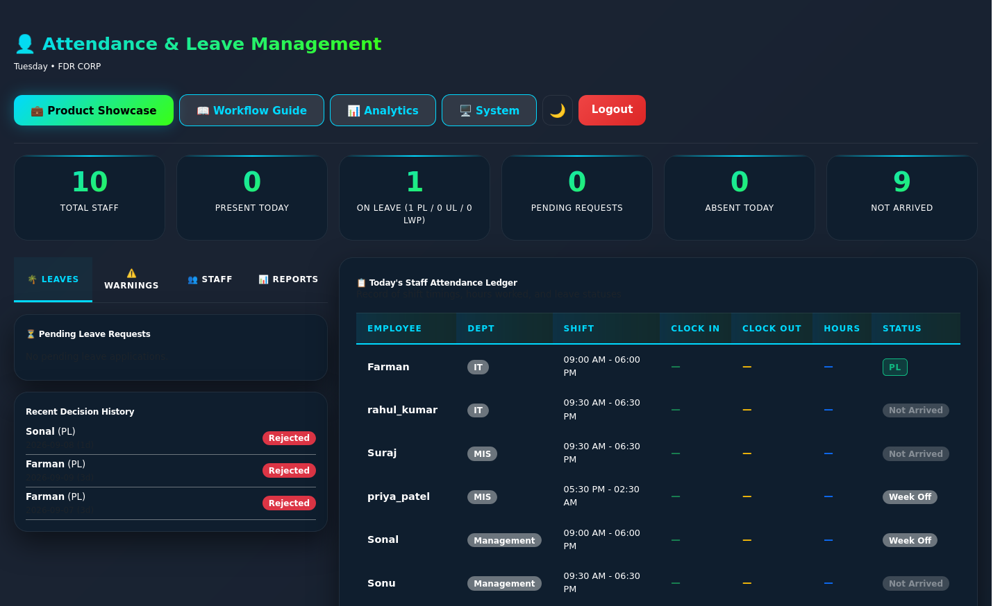
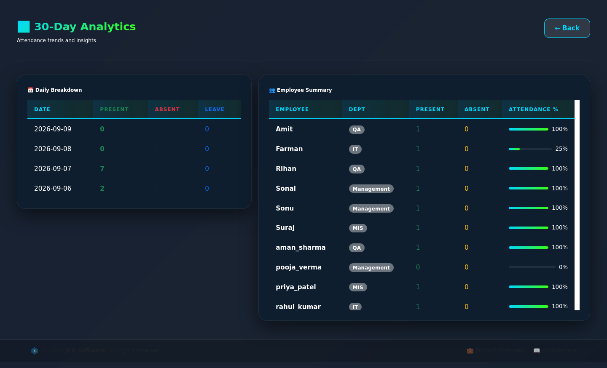
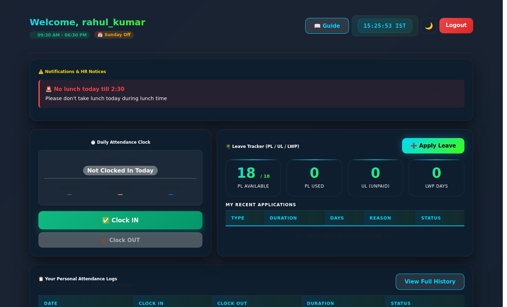
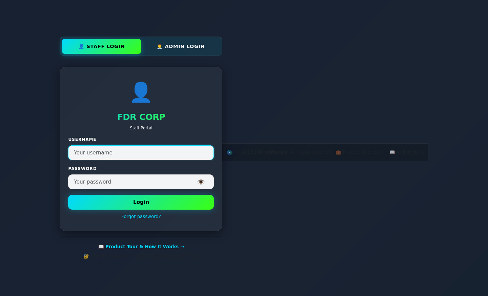

<div align="center">

# 🚀 Complete Staff & Employee Attendance Portal
### Full-Stack Python Flask & Docker Production Source Code

[-36a9ae?style=for-the-badge&logo=gumroad&logoColor=white)](https://farman3.gumroad.com/l/vbvjcq)
[](https://python.org)
[](https://flask.palletsprojects.com)
[](https://www.docker.com)
[](LICENSE.md)

<br/>

**A modern, self-hosted, enterprise-grade Employee Attendance, Timesheet, and Workforce Management System.**  
Built for businesses, agencies, freelancers, and dev teams who need a reliable, private, and customizable attendance portal with zero recurring subscription fees.

[🛒 **Get Full Source Code & Commercial License on Gumroad ($49)**](https://farman3.gumroad.com/l/vbvjcq)

<br/>



</div>

---

## ⚡ Why Choose This Source Code?

* ⏱️ **Save 100+ Hours of Development**: Complete authentication, 2FA, shift management, leave approvals, Excel reports, and Docker setup pre-built.
* 🐳 **1-Command Production Deployment**: Ready-to-go `docker-compose.yml` with multi-worker Gunicorn server.
* 🔒 **100% Private & Self-Hosted**: SQLite WAL mode engine with point-in-time automated database snapshots. Zero external tracking or SaaS lock-in.
* 💼 **Commercial Software License**: Full rights to deploy internally, rebrand, white-label, or customize for client projects.

---

## 📸 Visual Showcase & Previews

### 1. Administrative Control Center
Real-time KPI metrics, active headcount, on-leave counters, quick action drawer, and shift rosters.


### 2. Interactive Workforce Analytics
Visual attendance trend charts and department-wise workforce breakdown.


### 3. Staff Self-Service Portal
1-Click Punch In / Punch Out with live session timer, personal punch history, and statutory leave balance tracker.


### 4. Enterprise Login & 2FA Security
Modern responsive interface with two-factor PIN verification and brute-force lockout safeguards.


---

## 🌟 Key Features

### 👤 Employee / Staff Self-Service
* **1-Click Punch In / Out**: Real-time shift tracking, elapsed hours calculation, and live clock.
* **Shift & Week-off Display**: Instant visibility of assigned shifts and designated holidays.
* **Personal Timesheets**: View past punch history, total hours worked, and attendance status (Present, Late, Leave).
* **Leave Application Portal**: Request statutory leaves (Casual, Sick, Annual) with balance tracking and admin remarks.
* **2FA Security**: Multi-factor PIN verification for all user sessions.
* **Mobile-First Responsive UI**: Accessible seamlessly on desktop, tablet, and mobile browsers (Dark & Light mode).

### 🛡️ Admin Management Console
* **Live Workforce Dashboard**: Real-time counters of employees present, on leave, or off-duty.
* **Employee Management**: Add, update shifts, reassign week-offs, or soft-delete (relieve) employees while preserving historical audit records.
* **Leave Governance**: 1-click Approve or Reject leave requests with remarks; automatic balance deduction.
* **Payroll Ledger Export**: 1-click export of monthly attendance registers and work hours into standard `.xlsx` (Excel) spreadsheets.
* **Disciplinary & Company Broadcasts**: Issue official notices, warnings, and announcements directly to staff dashboards.
* **Automated Data Backups**: Midnight point-in-time snapshots and manual 1-click database backup/restore directly from the UI.

### 🔒 Security & Architecture
* **Self-Contained Database**: High-concurrency SQLite in Write-Ahead-Logging (`WAL`) mode with Gunicorn WSGI multi-threading.
* **Password Hashing**: Industry-standard cryptographic hashing (PBKDF2/scrypt).
* **Brute-Force Protection**: Automatic temporary account lockout after multiple failed authentication attempts.
* **CSRF Protection**: Form token validation on all state-changing endpoints.

---

## 🚀 Quick Start Guide

### Option 1: Run with Docker (Recommended)

Requires [Docker](https://www.docker.com/) and Docker Compose.

```bash
# 1. Clone or extract the project files
cd my-staff

# 2. Start the container in detached mode
docker compose up -d

# 3. Open your browser
http://localhost:5000
```

To view live container logs:
```bash
docker compose logs -f
```

To stop the container:
```bash
docker compose down
```

---

### Option 2: Run with Python Locally

Requires **Python 3.9+**.

```bash
# 1. Navigate to directory
cd my-staff

# 2. Create and activate a virtual environment
python3 -m venv venv
source venv/bin/activate       # On Linux/macOS
# .\venv\Scripts\activate     # On Windows

# 3. Install dependencies
pip install -r requirements.txt

# 4. Launch the application
python app.py

# 5. Open in browser: http://localhost:5000
```

---

## 🧙 First-Run Setup Wizard

When you launch the portal for the very first time on a fresh database:
1. You will be automatically redirected to the **Setup Wizard (`/setup`)**.
2. Enter your **Company / Organization Name**.
3. Choose your initial **Admin Username** and **Password**.
4. Click **Complete Setup** — the database schema initializes automatically!

---

## 📁 Package Structure

```text
├── app.py                     # Core Flask application, routes, and business logic
├── Dockerfile                 # Production multi-worker container definition
├── docker-compose.yml         # 1-click Docker orchestration
├── requirements.txt           # Python dependencies (Flask, Pandas, Gunicorn, etc.)
├── .env.example               # Clean configuration template
├── LICENSE.md                 # Commercial software license agreement
├── test_login.py              # Automated headless Selenium UI & auth test suite
├── backups/                   # Point-in-time database snapshot storage
├── static/
│   ├── app.css                # Polished Dark/Light theme styles
│   ├── app.js                 # UI interactions, clocks, and theme toggling
│   └── *.svg                  # Vector application icons and assets
└── templates/                 # Jinja2 HTML5 templates
    ├── base.html              # Core layout template
    ├── login.html             # Multi-role authentication interface
    ├── pin_verify.html        # 2FA PIN entry screen
    ├── setup.html             # First-run company onboarding wizard
    ├── staff.html             # Staff timesheet & leave portal
    ├── admin.html             # Administrative control center
    ├── analytics.html         # Visual metrics & charts
    └── system.html            # Server health & backup restore console
```

---

## 📦 Commercial Purchase & License

The complete, unminified, commercial source code package is available for purchase on Gumroad:

👉 **[Buy on Gumroad – $49.00 USD](https://farman3.gumroad.com/l/vbvjcq)**

### What's included with your purchase:
* ✅ Full, unminified Python Flask & frontend source code
* ✅ Production Docker & Docker Compose setup
* ✅ Standard Commercial License (Deploy for internal use, rebrand, or customize for client projects)
* ✅ Automated Selenium UI & authentication test suite
* ✅ Clean configuration template (`.env.example`) & step-by-step setup documentation
